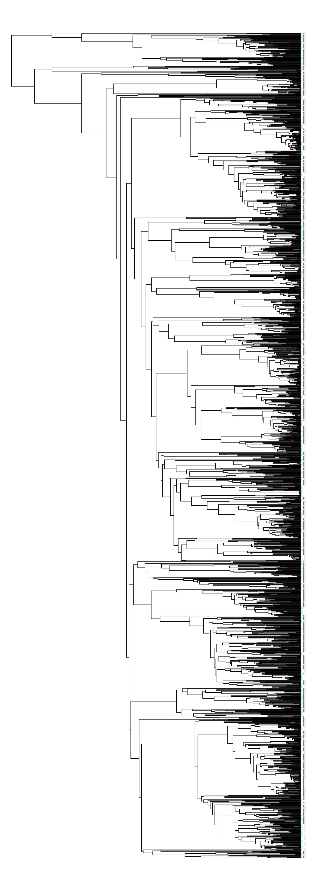

# Phylogenetic community assembly with the Fish Tree of Life

Here’s a quick example to show how we could use the `fishtree` package
to conduct some phylogenetic community analyses. First, we load
`fishtree` and ensure that the other packages that we need are
installed.

``` r

library(ape)
library(fishtree)
loadNamespace("rfishbase")
#> <environment: namespace:rfishbase>
loadNamespace("picante")
#> <environment: namespace:picante>
loadNamespace("geiger")
#> <environment: namespace:geiger>
```

Next we’ll start downloading some data from `rfishbase`. We’ll be seeing
if reef-associated ray-finned fish species are clustered or
overdispersed in the Atlantic, Pacific, and Indian Oceans.

``` r

# Get reef-associated species from the `species` table
species <- rfishbase::fb_tbl("species")
#> duckdb keeps downloaded extensions and secrets in a temporary directory:
#> ℹ /tmp/Rtmp0bweTW/duckdb
#> This is removed when the R session ends.
#> • Extensions are re-downloaded each session.
#> • Secrets are lost.
#> ℹ Run duckdb(shared_home = TRUE) (or create ~/.duckdb) to keep them (suitable for most users).
#> ℹ Run duckdb(shared_home = FALSE) to accept the temporary directory (and silence this message).
#> ℹ See ?duckdb_storage for details and alternatives.
species <- species[species$DemersPelag == "reef-associated", ]
reef_species <- paste(species$Genus, species$Species)

# Get native and endemic species from the Atlantic, Pacific, and Indian Oceans
eco <- rfishbase::ecosystem(species_list = reef_species)
#> Joining with `by = join_by(Subfamily, GenCode, FamCode)`
#> Joining with `by = join_by(FamCode)`
#> Joining with `by = join_by(Order, Ordnum, Class, ClassNum)`
#> Joining with `by = join_by(Class, ClassNum)`
#> Joining with `by = join_by(SpecCode)`
valid_idx <- eco$Status %in% c("native", "endemic") & eco$EcosystemName %in% c("Atlantic Ocean", "Pacific Ocean", "Indian Ocean") 
eco <- eco[valid_idx, c("Species", "EcosystemName")]

# Retrieve the phylogeny of only native reef species across all three oceans.
phy <- fishtree_phylogeny(species = eco$Species)
#> Warning: Requested 6492 but only found 4001 species.
#> • Scyris indica
#> • Lutjanus lemniscatus
#> • Lutjanus lunulatus
#> • Lutjanus timoriensis
#> • Macolor macularis
#> • ...and 2486 others
```

We’ll have to clean up the data in a few ways before sending it to
`picante` for analysis. First, we’ll need to convert our species-by-site
data frame into a presence-absence matrix. We’ll use
[`base::table`](https://rdrr.io/r/base/table.html) for this, and use
`unclass` to convert the `table` into a standard `matrix` object.

``` r

sample_matrix <- unclass(table(eco))
dimnames(sample_matrix)$Species <- gsub(" ", "_", dimnames(sample_matrix)$Species, fixed = TRUE)
```

Next, we’ll use
[`geiger::name.check`](https://rdrr.io/pkg/geiger/man/name.check.html)
to ensure the tip labels of the phylogeny and the rows of the data
matrix match each other.

``` r

nc <- geiger::name.check(phy, sample_matrix)
sample_matrix <- sample_matrix[!rownames(sample_matrix) %in% nc$data_not_tree, ]
```

Finally, we’ll generate the cophenetic matrix based on the phylogeny,
and transpose the presence-absence matrix since `picante` likes its
columns to be species and its rows to be sites.

``` r

cophen <- cophenetic(phy)
sample_matrix <- t(sample_matrix)
```

We’ll run
[`picante::ses.mpd`](https://rdrr.io/pkg/picante/man/ses.mpd.html) and
[`picante::ses.mntd`](https://rdrr.io/pkg/picante/man/ses.mntd.html)
with only 100 iterations, to speed up the analysis. For a real analysis
you would likely increase this to 1000, and possibly test other null
models if your datasets have e.g., abundance information.

``` r

picante::ses.mpd(sample_matrix, cophen, null.model = "taxa.labels", runs = 99)
#>                ntaxa  mpd.obs mpd.rand.mean mpd.rand.sd mpd.obs.rank  mpd.obs.z
#> Atlantic Ocean   585 239.0055      232.1327   2.2346591          100 3.07554839
#> Indian Ocean    1215 233.5489      232.4824   1.1748913           83 0.90779194
#> Pacific Ocean   1419 232.2639      232.2036   0.9885731           53 0.06103204
#>                mpd.obs.p runs
#> Atlantic Ocean      1.00   99
#> Indian Ocean        0.83   99
#> Pacific Ocean       0.53   99
picante::ses.mntd(sample_matrix, cophen, null.model = "taxa.labels", runs = 99)
#>                ntaxa mntd.obs mntd.rand.mean mntd.rand.sd mntd.obs.rank
#> Atlantic Ocean   585 42.15678       48.78075    1.6512804             1
#> Indian Ocean    1215 34.37517       37.61213    0.6833006             1
#> Pacific Ocean   1419 34.61914       35.35819    0.5180346            10
#>                mntd.obs.z mntd.obs.p runs
#> Atlantic Ocean  -4.011414       0.01   99
#> Indian Ocean    -4.737241       0.01   99
#> Pacific Ocean   -1.426641       0.10   99
```

The Atlantic and Indian Oceans are overdispersed using the MPD metric,
and all three oceans are clustered under the MNTD metric. MPD is thought
to be more sensitive to patterns closer to the root of the tree, while
MNTD is thought to more closely reflect patterns towards the tips of the
phylogeny.

We can confirm these patterns visually by running the following code,
which will plot the phylogeny and add colored dots (red, green, and
blue) to indicate whether a tip is associated with a specific ocean
basin.

``` r

plot(phy, show.tip.label = FALSE, no.margin = TRUE)
obj <- get("last_plot.phylo", .PlotPhyloEnv)

matr <- t(sample_matrix)[phy$tip.label, ]
xx <- obj$xx[1:obj$Ntip]
yy <- obj$yy[1:obj$Ntip]
cols <- c("#1b9e77", "#d95f02", "#7570b3")
for (ii in 1:ncol(matr)) {
  present_idx <- matr[, ii] == 1
  points(xx[present_idx] + ii, yy[present_idx], col = cols[ii], cex = 0.1)
}
```


