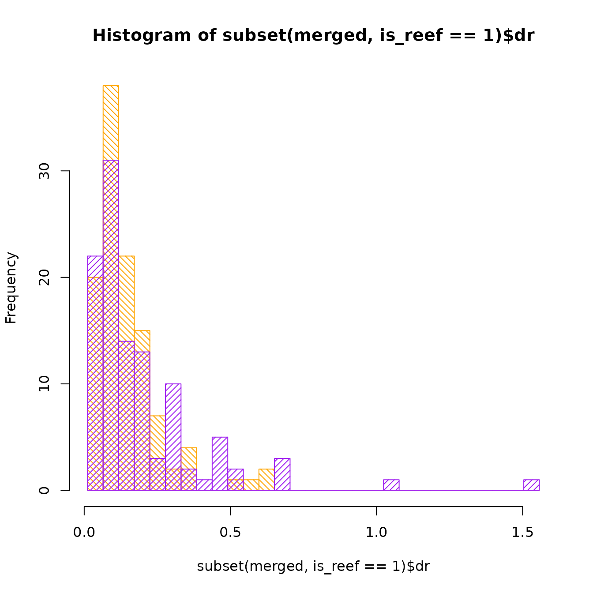

# A simple comparative analysis with the Fish Tree of Life

To demonstrate the functionality of the `fishtree` package and how it
integrates well with the rest of the R phylogenetics ecosystem, this
vignette will walk you through a simple comparative analysis.

## Getting and cleaning data

A common hypothesis tested in comparative methods is whether habitat
shifts drive rates of diversification in various groups. For example,
[Santini et al. (2013)](https://doi.org/10.1111/jeb.12112) tested, among
other things, whether reef-associated pufferfishes enjoyed faster rates
of speciation compared to their non-reef relatives.

First, load the `fishtree` package and download the subset of the Fish
Tree of Life corresponding to the taxon of interest. To make things more
interesting we’ll work on the entire order
([Tetraodontiformes](https://fishtreeoflife.org/taxonomy/order/Tetraodontiformes/))
rather than the family in the 2013 study.

``` r
library(fishtree)

tree <- fishtree_phylogeny(rank = "Tetraodontiformes")

plot(tree, show.tip.label = FALSE, no.margin = TRUE)
```


Next, we need to get habitat data and associate it with our phylogeny.
The `rfishbase` package ([Boettiger et
al. 2012](https://doi.org/10.1111/j.1095-8649.2012.03464.x)) has a
variety of convenient functions to access data recorded by the Fishbase
editors. Load the `rfishbase` package and retrieve the relevant data in
the `DemersPelag` field, which identifies whether a species is
reef-associated or not, among other things.

``` r
library(rfishbase)

tips <- gsub("_", " ", tree$tip.label, fixed = TRUE)

fb_results <- species(species_list = tips, fields = c("Species", "DemersPelag"))
#> Joining with `by = join_by(SpecCode)`
fb_results <- fb_results[!is.na(fb_results$DemersPelag), ]
head(fb_results)
#> # A tibble: 6 × 2
#>   Species                       DemersPelag    
#>   <chr>                         <chr>          
#> 1 Abalistes stellatus           demersal       
#> 2 Acanthaluteres spilomelanurus demersal       
#> 3 Acanthaluteres vittiger       demersal       
#> 4 Acanthostracion quadricornis  reef-associated
#> 5 Acreichthys tomentosus        reef-associated
#> 6 Allomycterus pilatus          demersal
```

Note that we had to replace the underscores in the tip labels with
spaces. This is a common source of errors, so if your analyses don’t
seem to work correctly always check whether the functions you’re using
expect underscores or spaces.

There’s a lot of data in the `DemersPelag` field, but we only want to
know if the species is reef-associated or not.

``` r
reef <- data.frame(tip = gsub(" ", "_", fb_results$Species),
                   is_reef = as.numeric(fb_results$DemersPelag == "reef-associated"))
head(reef)
#>                             tip is_reef
#> 1           Abalistes_stellatus       0
#> 2 Acanthaluteres_spilomelanurus       0
#> 3       Acanthaluteres_vittiger       0
#> 4  Acanthostracion_quadricornis       1
#> 5        Acreichthys_tomentosus       1
#> 6          Allomycterus_pilatus       0
```

We’ve also converted the tip labels back to underscores, since we need
to ensure that the tip labels on our phylogeny match the labels on our
trait data. The `geiger` package ([Pennell et
al. 2014](https://doi.org/10.1093/bioinformatics/btu181)) provides a
convenient function that will perform this check. The `name.check`
function expects row names on our data object, so we will do that as
well.

``` r
library(geiger)
#> Loading required package: ape
#> Loading required package: phytools
#> Loading required package: maps

rownames(reef) <- reef$tip
nc <- geiger::name.check(tree, reef)
nc
#> $tree_not_data
#>  [1] "Abalistes_stellaris"                   
#>  [2] "Acanthostracion_polygonius"            
#>  [3] "Chelonodon_patoca"                     
#>  [4] "Chelonodon_pleurospilus"               
#>  [5] "Chilomycterus_spinosus_spinosus"       
#>  [6] "Lagocephalus_lagocephalus_lagocephalus"
#>  [7] "Monotrete_cochinchinensis"             
#>  [8] "Monotrete_leiurus"                     
#>  [9] "Ostracion_cubicus"                     
#> [10] "Ostracion_immaculatus"                 
#> [11] "Ostracion_solorensis"                  
#> [12] "Paramonacanthus_filicauda"             
#> [13] "Rhinesomus_triqueter"                  
#> [14] "Sphoeroides_cheesemanii"               
#> [15] "Stephanolepis_auratus"                 
#> [16] "Stephanolepis_hispidus"                
#> [17] "Takifugu_fasciatus"                    
#> [18] "Tetraodon_abei"                        
#> [19] "Tetraodon_baileyi"                     
#> [20] "Tetraodon_biocellatus"                 
#> [21] "Tetraodon_cambodgiensis"               
#> [22] "Tetraodon_cutcutia"                    
#> [23] "Tetraodon_erythrotaenia"               
#> [24] "Tetraodon_fluviatilis"                 
#> [25] "Tetraodon_nigroviridis"                
#> [26] "Tetraodon_palembangensis"              
#> [27] "Tetraodon_suvattii"                    
#> [28] "Tetraodon_turgidus"                    
#> [29] "Tetrosomus_fornasini"                  
#> 
#> $data_not_tree
#> character(0)
```

We’ve identified a mismatch between the tree and the data. We’ll exclude
the tips lacking trait data using `drop.tip`:

``` r
library(ape)
tree <- drop.tip(tree, nc$tree_not_data)
```

If we also had data that was not in the tree, we could exclude that
using the following command, but it isn’t necessary in this case:

``` r
reef <- reef[!rownames(reef) %in% nc$data_not_tree, ]
```

Confirm that we have the same number of observations in the tree and the
data:

``` r
Ntip(tree) == nrow(reef)
#> [1] TRUE
```

## Plotting diversification rates

There are several other data sources available in the `fishtree`
package, including speciation rates computed via the DR method ([Jetz et
al. 2012](https://doi.org/10.1038/nature11631)). Retrieve speciation
rate data:

``` r
rates <- fishtree_tip_rates(rank = "Tetraodontiformes")
head(rates)
#>                           species  lambda.tv      mu.tv  lambda.tc      mu.tc
#> 2             Abalistes stellaris 0.08859469 0.01282721 0.09181900 0.02239813
#> 3             Abalistes stellatus 0.08859469 0.01282721 0.09181900 0.02239813
#> 34  Acanthaluteres spilomelanurus 0.10180976 0.01614045 0.16054060 0.06301037
#> 35        Acanthaluteres vittiger 0.10180976 0.01614045 0.16054060 0.06301037
#> 131    Acanthostracion polygonius 0.08549937 0.01178475 0.07697343 0.01359198
#> 132  Acanthostracion quadricornis 0.08549937 0.01178475 0.07697343 0.01359198
#>             dr
#> 2   0.11678851
#> 3   0.11909205
#> 34  0.28175984
#> 35  0.28406568
#> 131 0.07606301
#> 132 0.07213440
```

We’re interested in just the `dr` column, so extract that and convert
spaces to underscores again. Then merge the habitat data with the
speciation rate data.

``` r
rates <- data.frame(tip = gsub(" ", "_", rates$species), dr = rates$dr)
rownames(rates) <- rates$tip
merged <- merge(reef, rates)
```

As a quick check our data, let’s plot histograms of the DR rate of reef
and non-reef species:

``` r
breaks <- seq(min(merged$dr), max(merged$dr), length.out = 30)
hist(subset(merged, is_reef == 1)$dr, col = "orange", density = 20, angle = 135,
     breaks = breaks)
hist(subset(merged, is_reef == 0)$dr, col = "purple", density = 20, angle = 45,
     breaks = breaks, add = TRUE)
```



It seems like for the most part, the Tetraodontiformes have a low
speciation rate, except for a subset of non-reef species that have a
faster rate.

Of course, with any comparative method, it’s critical to consider the
historical relationships between the species you’re examining. The
following snippet of code is quite complex, but demonstrates how to draw
rates onto a phylogeny using colored bars next to each tip in question.

``` r
# Plot tree and extract plotting data
plot(tree, show.tip.label = FALSE, no.margin = TRUE)
obj <- get("last_plot.phylo", .PlotPhyloEnv)

# Generate a color ramp
ramp <- grDevices::colorRamp(c("black", "red"), bias = 10)
tiporder <- match(rates$tip, tree$tip.label)
scaled_rates <- rates$dr / max(rates$dr, na.rm = TRUE)
tipcols <- apply(ramp(scaled_rates), 1, function(x) do.call(rgb, as.list(x / 255)))

# Place colored bars
for (ii in 1:length(tiporder)) {
    tip <- tiporder[ii]
    lines(x = c(obj$xx[tip] + 0.5, obj$xx[tip] * 1.5 + 0.5 + scaled_rates[ii]),
          y = rep(obj$yy[tip], 2),
          col = tipcols[ii])
}
```


## Running an analysis

Let’s perform a more quantitative analysis using using `hisse`. We’ll
test 4 models: a BiSSE-like model, a BiSSE-like null model, a hisse
model, and the hisse 2 state null model.

``` r
library(hisse)
#> Loading required package: deSolve
#> Loading required package: GenSA
#> Loading required package: subplex
#> Loading required package: nloptr
```

The `hisse` package parameterizes things differently from `diversitree`
(where BiSSE lives), so we aren’t able to exactly replicate the analyses
in the Santini paper. Instead we’ll settle by ensuring that the epsilon
parameter, $\epsilon = \frac{\mu}{\lambda}$ is constrained to be equal
for both reef and non-reef taxa. We’ll also constrain transition rates
to be equal, since it can be difficult to estimate those.

Note that to ensure this vignette can be run in a reasonable amount of
time, we set `sann = FALSE` to disable the simulated annealing procedure
in `hisse`. However, for any actual analysis this option should be
turned on for maximum accuracy and confidence in your final results.

First, we’ll construct and run the BiSSE model and the BiSSE null model:

``` r
trans.rates.bisse <- TransMatMakerHiSSE()

pp.bisse.full <- hisse(tree, reef,
                       hidden.states = FALSE, sann = FALSE,
                       turnover = c(1, 2), eps = c(1, 1),
                       trans.rate = trans.rates.bisse)
#> Warning in hisse(tree, reef, hidden.states = FALSE, sann = FALSE, turnover =
#> c(1, : You have chosen to rely on the internal starting points that generally
#> work but does not guarantee finding the MLE.
#> Initializing... 
#> Finished. Beginning bounded subplex routine... 
#> Finished. Summarizing results...

pp.bisse.null <- hisse(tree, reef,
                       hidden.states = FALSE, sann = FALSE,
                       turnover = c(1, 1), eps = c(1, 1),
                       trans.rate = trans.rates.bisse)
#> Warning in hisse(tree, reef, hidden.states = FALSE, sann = FALSE, turnover =
#> c(1, : You have chosen to rely on the internal starting points that generally
#> work but does not guarantee finding the MLE.
#> Initializing... 
#> Finished. Beginning bounded subplex routine... 
#> Finished. Summarizing results...
```

Next, we’ll run the full hisse model, save for the constrained
transition rates and epsilon.

``` r
trans.rates.hisse <- TransMatMakerHiSSE(hidden.traits = 1)
trans.rates.hisse <- ParEqual(trans.rates.hisse, c(1, 2, 1, 3, 1, 4, 1, 5))

pp.hisse.full <- hisse(tree, reef,
                       hidden.states = TRUE, sann = FALSE,
                       turnover = c(1, 2, 3, 4), eps = c(1, 1, 1, 1),
                       trans.rate = trans.rates.hisse)
#> Warning in hisse(tree, reef, hidden.states = TRUE, sann = FALSE, turnover =
#> c(1, : You have chosen to rely on the internal starting points that generally
#> work but does not guarantee finding the MLE.
#> Initializing... 
#> Finished. Beginning bounded subplex routine... 
#> Finished. Summarizing results...
```

Finally, we’ll build the 2 state character independent diversification
model, sometimes called CID-2. We’ll use this as our null model by
forcing the visible states (reef or non-reef) to have the same net
turnover rates, while permitting the hidden states to vary freely.

``` r
pp.hisse.null2 <- hisse(tree, reef,
                        hidden.states = TRUE, sann = FALSE,
                        turnover = c(1, 1, 2, 2), eps = c(1, 1, 1, 1),
                        trans.rate = trans.rates.hisse)
#> Warning in hisse(tree, reef, hidden.states = TRUE, sann = FALSE, turnover =
#> c(1, : You have chosen to rely on the internal starting points that generally
#> work but does not guarantee finding the MLE.
#> Initializing... 
#> Finished. Beginning bounded subplex routine... 
#> Finished. Summarizing results...
```

We can combine all of our results into a single table for easy
comparison.

``` r
results <- list(pp.bisse.full, pp.bisse.null, pp.hisse.null2, pp.hisse.full)
aicc <- sapply(results, `[[`, "AICc")
lnl <- sapply(results, `[[`, "loglik")

data.frame(model = c("bisse_full", "bisse_null", "hisse_cid2", "hisse_full"), aicc, lnl)
#>        model     aicc       lnl
#> 1 bisse_full 1829.695 -909.7075
#> 2 bisse_null 1827.743 -909.7785
#> 3 hisse_cid2 1816.876 -904.3447
#> 4 hisse_full 1820.233 -903.9193
```

Summarizing the results on the basis of AICc suggests that the best
supported model is a null model, where habitat has no effect on
speciation rate.
